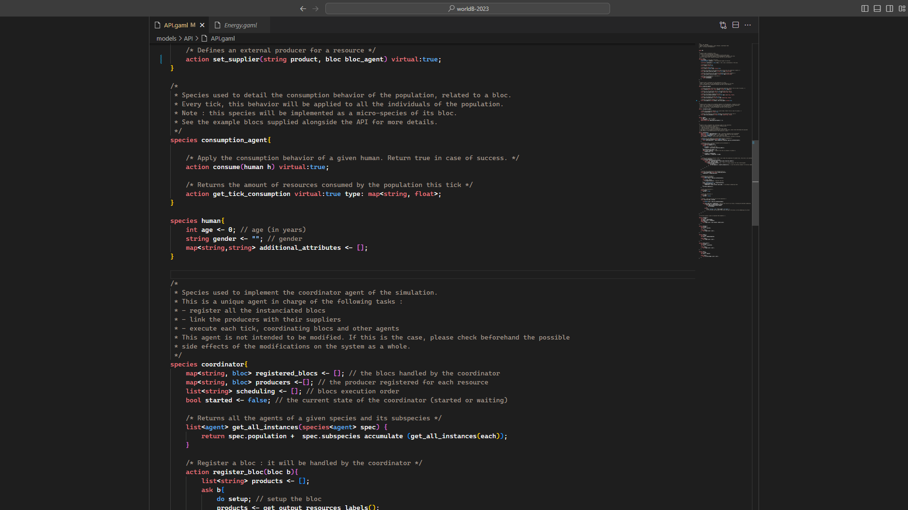
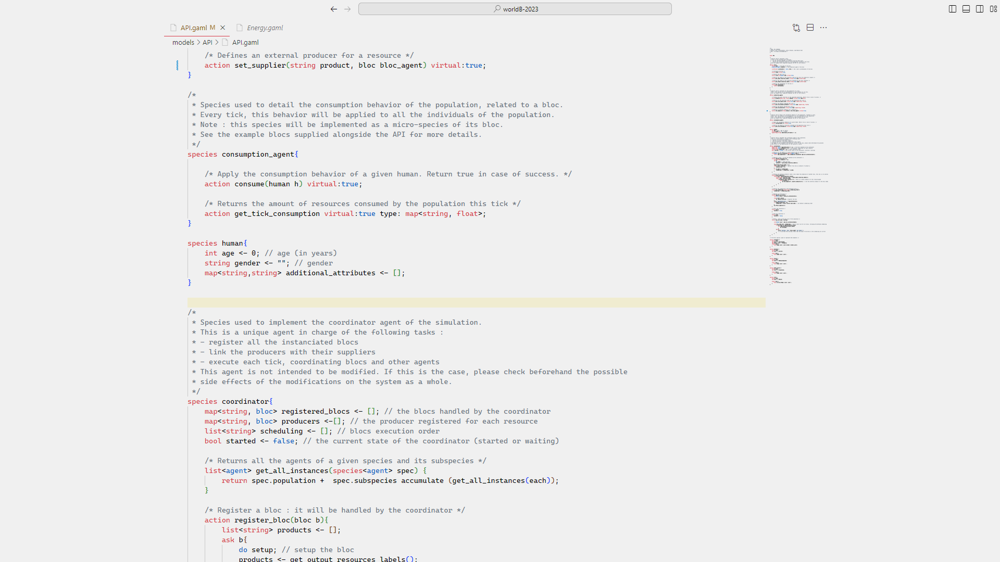

# GAML Syntax Highlighter

This extension provides syntax highlighting for the GAML language.

Here is an example of the syntax highlighting with a dark theme:

  

And here is an example of the syntax highlighting with a light theme:

  

> Note: This extension is in development. If you have any issues or suggestions, please open an issue.

## Release Notes

Users appreciate release notes as you update your extension.

### 1.0.0

Initial release of GAML Syntax Highlighter with basic syntax highlighting.

---

**Enjoy!**
